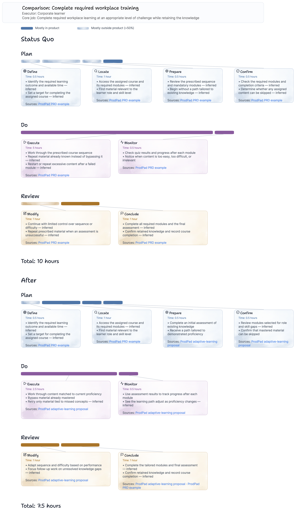

# Job Map Diagrams

A reusable Codex skill for turning customer problems and proposed product interventions into evidence-backed Jobs-to-be-Done job maps rendered with [Eraser Diagrams](https://github.com/eraserlabs/eraser-diagrams).

The skill helps product managers move from unstructured customer evidence to a consistent eight-stage map, then visualize the current experience, a proposed future experience, or both side by side.



## What it does

- Accepts a written customer problem or source document.
- Asks a short set of follow-up questions when important information is missing.
- Maps the job into Define, Locate, Prepare, Confirm, Execute, Monitor, Modify, and Conclude.
- Groups those stages into Plan, Do, and Review.
- Generates a **Status Quo**, **After**, or combined **Comparison** view.
- Supports proportional **time** and **funnel drop-off** representations.
- Uses watercolor bars when more than half of a stage's work happens outside the product, while preserving the Plan/Do/Review colors.
- Distinguishes direct customer evidence, proposal evidence, and JTBD method guidance.
- Adds evidence links to the stage cards and marks inferred activities.
- Produces editable Eraser Diagrams JSON plus a rendered preview when Chromium is available.

Each stage is represented by a proportional bar and an auto-height activity card. Subtle connectors associate bars with their cards. Comparison views use one shared scale so the before and after measurements remain visually comparable.

## Install the skill

Clone the repository and copy the skill folder into your personal Codex skills directory:

```bash
git clone https://github.com/kbk0125/JTBD-visualizer.git
mkdir -p ~/.codex/skills
cp -R JTBD-visualizer/skills/job-map-diagrams ~/.codex/skills/job-map-diagrams
```

Restart Codex after installation so it discovers the skill.

## Use it

Invoke the skill with a customer problem, a document, or links to supporting evidence. For example:

```text
Use $job-map-diagrams to turn this customer problem into a comparison job map.
Show the current workflow and the workflow after our proposed intervention.
Use elapsed time for the stage measurements.
```

Before rendering, the skill confirms the view and measurement type, collects all eight measurements, and asks what percentage of each stage happens outside the product. It does not invent missing quantitative data.

### Available views

| View | Output |
| --- | --- |
| Status Quo | The job as customers accomplish it today |
| After | The job after the proposed intervention |
| Comparison | Status Quo and After maps in one diagram |

### Available measurements

| Representation | Stage input | Total shown |
| --- | --- | --- |
| Time | Positive hours or weeks | Total elapsed time |
| Funnel | Conditional percentage dropping off at each stage | Percentage reaching the end |

Funnel completion is calculated multiplicatively because each stage's drop-off applies only to the people who reached that stage.

## Example

The included fixture is based on the adaptive-learning problem described in ProdPad's [PRD example](https://www.prodpad.com/blog/prd-example/). It compares a 10-hour Status Quo flow with a proposed After flow where Execute becomes 50% faster and the other stage durations remain unchanged. Its product-boundary percentages are illustrative assumptions added to demonstrate the plain and watercolor bar treatments; they are not claims made by the article.

- [Input specification](skills/job-map-diagrams/examples/prodpad-adaptive-learning-spec.json)
- [Editable Eraser JSON](skills/job-map-diagrams/examples/prodpad-adaptive-learning.json)
- [Rendered PNG](skills/job-map-diagrams/examples/prodpad-adaptive-learning.png)

The eight-stage structure follows Strategyn's [customer-centered innovation map](https://strategyn.com/jobs-to-be-done/customer-centered-innovation-map/). Method sources guide organization but are not presented as evidence for customer behavior.

## Generate a diagram directly

The deterministic builder can also be run without invoking the conversational workflow:

```bash
cd skills/job-map-diagrams
python3 scripts/build_job_map.py \
  examples/prodpad-adaptive-learning-spec.json \
  examples/prodpad-adaptive-learning.json
```

The input schema is documented in [job-map-spec.md](skills/job-map-diagrams/references/job-map-spec.md).

## Validate and render

The builder itself uses the Python standard library. Rendering requires Node.js 22.12 or newer and the Eraser Diagrams CLI:

```bash
npx @eraserlabs/diagrams-cli validate \
  skills/job-map-diagrams/examples/prodpad-adaptive-learning.json \
  --fail-on-warning

npx @eraserlabs/diagrams-cli render \
  skills/job-map-diagrams/examples/prodpad-adaptive-learning.json \
  -o skills/job-map-diagrams/examples/prodpad-adaptive-learning.png \
  --scale 2
```

Cropping the near-white margins from watercolor renders is optional and requires Pillow:

```bash
python3 skills/job-map-diagrams/scripts/crop_render.py \
  skills/job-map-diagrams/examples/prodpad-adaptive-learning.png \
  --padding 24
```

## Repository structure

```text
skills/job-map-diagrams/
├── SKILL.md                 Skill workflow and behavior
├── agents/openai.yaml       Codex display metadata
├── examples/                Canonical specification, Eraser JSON, and preview
├── references/              JTBD method, schema, layout, and Eraser notes
└── scripts/                 Validator, metrics, layout, and renderer builder
```

## Current scope

- The stage taxonomy and Plan/Do/Review grouping are fixed in schema version 2.
- A comparison uses the same representation and shared bar scale for both states.
- Time values accept hours or weeks; percentage-based duration inputs are intentionally rejected.
- Funnel inputs are conditional stage drop-off rates from 0% through 100%.
- Every stage includes an outside-product estimate from 0% through 100%; bars use watercolor styling only above 50%. The percentages remain in the source specification rather than appearing on cards.

## License

Released under the [MIT License](LICENSE).

Eraser Diagrams is a separate open-source project maintained by Eraser Labs. This repository is not affiliated with or endorsed by Strategyn or ProdPad.
